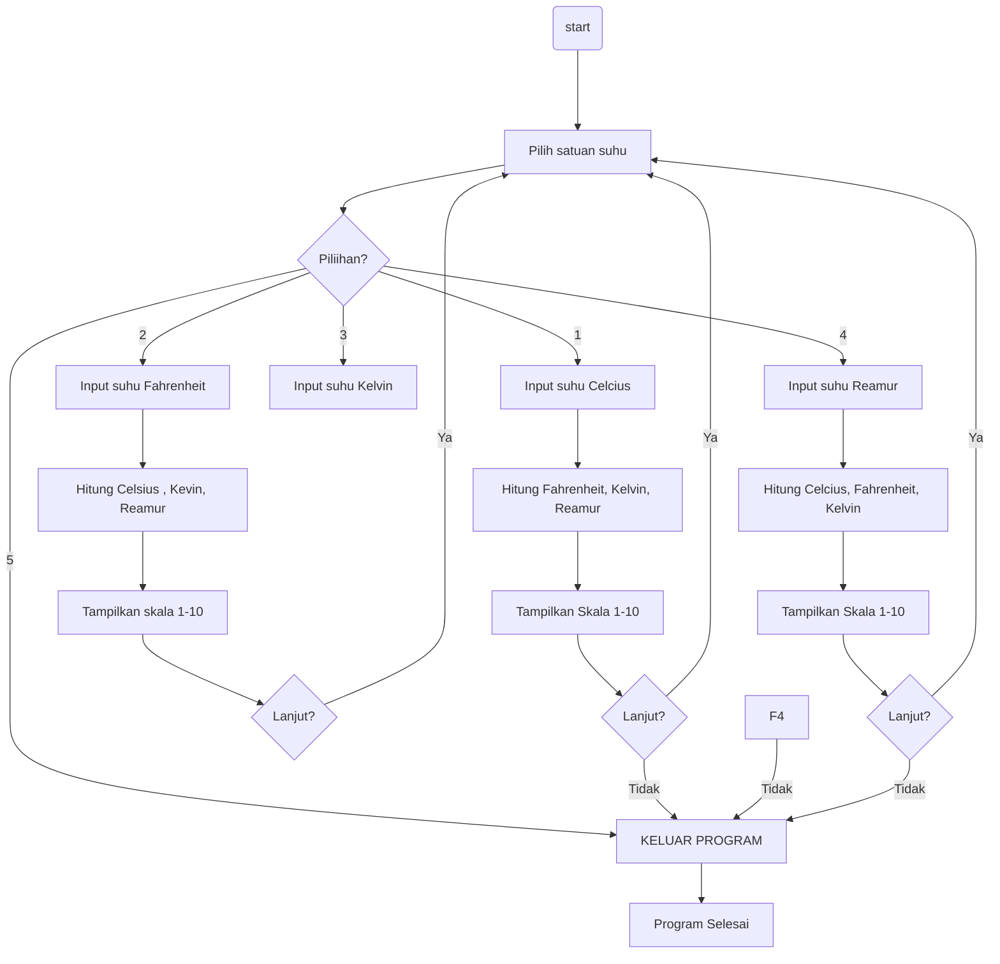

<br />
<div align="center">
  <a href="https://github.com/frekejulandolumi/pengenalan-pemrograman.git">
    
  </a>

  <h3 align="center">PROGRAM KONVERSI SUHU</h3>

  <p align="center">
    Python Temperature Conversion App — User-Friendly & Interactive
    <br />
    <a href="https://github.com/frekejulandolumi/pengenalan-pemrograman.git"><strong>Explore the docs »</strong></a>
    <br />
    <a href="https://github.com/frekejulandolumi/pengenalan-pemrograman.git">Report Bug</a>
    &middot;
    <a href="https://github.com/frekejulandolumi/pengenalan-pemrograman.git">Request Feature</a>
  </p>
</div>

## Table of Contents
* [Pendahuluan](#pendahuluan)
* [Fitur Utama](#fitur-utama)
* [Panduan Instalasi](#panduan-instalasi)
* [Panduan Menjalankan Program](#panduan-menjalankan-program)
* [Dokumentasi Teknis](#dokumentasi-teknis)
* [Daftar Kontributor](#daftar-kontributor)

## Pendahuluan
Program Konversi Suhu ini merupakan aplikasi berbasis Python yang dirancang untuk melakukan konversi suhu antara empat skala utama, yaitu Celsius, Fahrenheit, Kelvin, dan Reamur. Program ini menyediakan antarmuka terminal yang interaktif, mudah digunakan, serta dilengkapi dengan tampilan visual berupa Heat-Level Bar yang menunjukkan intensitas panas pada skala 0–10.

Fitur ini membantu pengguna memahami gambaran tingkat panas secara lebih intuitif, tidak hanya melalui angka tetapi juga melalui representasi visual.

Empat skala yang didukung program ini:
* 🌡 Celsius
* ❄️ Fahrenheit
* 🔷 Kelvin
* 🟠 Reamur

Dengan validasi input, tampilan berwarna, dan sistem menu yang jelas, program ini dapat digunakan sebagai alat bantu pembelajaran maupun sebagai aplikasi sederhana untuk memahami konversi suhu.


## Fitur Utama

### Konversi Suhu Antar Skala
  - Dari Celsius ke Fahrenheit, Kelvin, dan Reamur.
  - Dari Fahrenheit ke Celsius, Kelvin, dan Reamur.
  - Dari Kelvin ke Celsius, Fahrenheit, dan Reamur.
  - Dari Reamur ke Celsius, Fahrenheit, dan Kelvin.

### Validasi Input
  - Menangani error jika pengguna memasukkan nilai bukan angka (ValueError).
  - Memberikan pesan khusus jika suhu Kelvin dimasukkan negatif (karena tidak valid).

### Fitur Tambahan Thermometer Skala 1–10
  - Menampilkan intensitas panas dalam bentuk bar visual.
  - Skala 0–10 berdasarkan suhu dalam Celsius.
  - Memberikan status deskriptif:
    - 0 → Sangat Dingin
    - 1–3 → Normal
    - 4–6 → Hangat
    - 7–9 → Panas
    - 10 → Ekstrem

### Menu Interaktif
  - Pengguna dapat memilih satuan suhu awal (Celsius, Fahrenheit, Kelvin, Reamur).
  - Opsi keluar dari program.
  - Program berjalan dalam loop sehingga bisa digunakan berulang kali.

### Fitur Lanjut/Tidak Lanjut
  - Setelah konversi, pengguna ditanya apakah ingin melanjutkan.
  - Jika memilih tidak, program berhenti dengan pesan terima kasih.
    
## Panduan Instalasi

Ikuti langkah-langkah berikut agar program *Konversi Suhu Python* siap dijalankan:

> *💡 Tips:* Pastikan Python versi 3.x sudah terinstal sebelum memulai.


### 1️⃣ Clone Repository
```bash
git clone https://github.com/username/nama-repo.git
```
📌 Catatan: Pastikan koneksi internet stabil supaya clone berhasil.


### 2️⃣ Masuk ke Folder Project
```bash
cd nama-repo
```
✅ Pastikan berada di folder yang benar sebelum melanjutkan step berikutnya. 


### 3️⃣ Buat Virtual Environment (Opsional)
```bash
python -m venv venv
```
Aktifkan:
  - Windows:
    ```bash
    venv\Scripts\activate
    ```
  - Mac/Linux:
    ```bash
    source venv/bin/activate
    ```
📌 Catatan: Virtual environment membantu supaya library program tidak bentrok dengan library Python lain di komputer.

### 4️⃣ Install Dependencies
```bash
pip install -r requirements.txt
```
💡 Tips: Gunakan pip list untuk cek library sudah terpasang.

⚠️ Jika ada error, coba jalankan python -m pip install --upgrade pip dulu.

## Panduan Menjalankan


## Dokumentasi Teknis



## Daftar Kontributor 👥 

| No|            Nama                |      NIM     |                   GitHub                     |
|---|   ------                       |   --------   |     -----------------------                  |
| 1 |Freke Julando Cristen Lumi      | 250211060081 | https://github.com/frekejulandolumi          |
| 2 |Kharis Evangel Mantiri          | 250211060086 | https://github.com/nimeightysix-86           |
| 3 |Mentari Kristen Rachaelea Toreh | 250211060087 | https://github.com/mentarirachaelea          |
| 4 |Mirecle Zefanya Kapoh           | 250211060088 | https://github.com/mireclezefanyakapoh06-afk |
